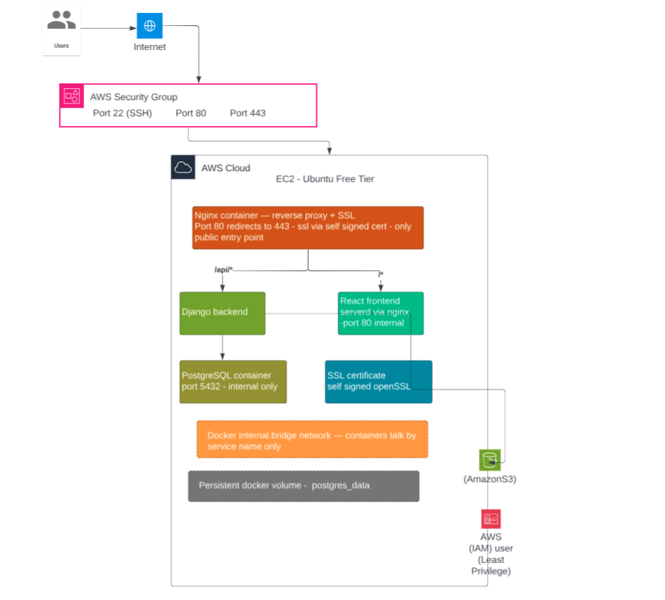

# NoteVault

**Stack:** Django REST Framework · React · PostgreSQL · Docker · AWS EC2 · S3 · Nginx

---

## ARCHITECTURE DESIGN

```
Internet (Users)
       │
       ▼
[AWS Security Group]
  Port 80  ✅ open
  Port 443 ✅ open
  Port 22  ✅ open (your IP only)
  Port 5432 🔒 BLOCKED
  Port 8000 🔒 BLOCKED
       │
       ▼
[EC2 t2.micro - Ubuntu 22.04]
       │
       ▼
[Nginx Container] ← Single entry point, reverse proxy
       │
       ├──── /api/*  ──────► [Django Backend Container :8000]
       │                              │
       │                              ▼
       │                     [PostgreSQL Container]
       │                     (internal network only)
       │
       └──── /*  ──────────► [React Frontend Container :80]

[Django Backend] ──── file uploads ────► [AWS S3 Bucket]
                       (via IAM least privilege)
```



**Key Design Decisions:**
- Nginx is the ONLY container exposed to the internet
- PostgreSQL is NEVER exposed publicly — internal Docker network only
- All secrets are in environment variables — zero hardcoded credentials
- IAM user has access to ONE S3 bucket only — least privilege
- Docker Compose manages all 4 services together

---


## API ENDPOINTS

| Method | URL | Description |
|--------|-----|-------------|
| GET | `/api/notes/` | List all notes |
| POST | `/api/notes/` | Create a new note |
| GET | `/api/notes/{id}/` | Get single note |
| PATCH | `/api/notes/{id}/` | Update a note |
| DELETE | `/api/notes/{id}/` | Delete a note |
| POST | `/api/notes/upload-s3/` | Upload file directly to S3 |

---

## FULL DEPLOYMENT STEPS — STEP 1 TO END

---

### STEP 1 — Create GitHub Repository

**Why:** Th assignment requires submitting a GitHub repo with all code.

1. Go to https://github.com and sign in
2. Click the green **"New"** button
3. Repository name: `notes-crud-app`
4. Set to **Public**
5. Do NOT add README or .gitignore (we already have them)
6. Click **"Create repository"**
7. Copy the repo URL — looks like: `https://github.com/YOUR_USERNAME/notes-crud-app.git`

---

### STEP 2 — Launch EC2 Instance on AWS

**Why:** EC2 is the virtual server that will host all our Docker containers.

1. Go to https://console.aws.amazon.com
2. In the top search bar type **EC2** → click it
3. Click the orange **"Launch Instance"** button
4. Fill in these exact settings:

| Field | Value |
|-------|-------|
| Name | `notes-crud-app` |
| OS Image | **Ubuntu Server 22.04 LTS** |
| Instance type | **t2.micro** (Free Tier eligible) |
| Key pair | Click "Create new key pair" |

5. Key pair settings:
   - Name: `notes-key`
   - Type: RSA
   - Format: **.pem**
   - Click **"Create key pair"**
   - File downloads automatically — **SAVE IT, YOU CANNOT GET IT AGAIN**

6. Under **"Network settings"** click **Edit** and add these rules:

| Type | Port | Source | Why |
|------|------|--------|-----|
| SSH | 22 | My IP | Admin access from your computer only |
| HTTP | 80 | 0.0.0.0/0 | Public web access |
| HTTPS | 443 | 0.0.0.0/0 | Secure public web access |

7. Storage: set to **20 GB**
8. Click **"Launch Instance"**
9. Wait 2 minutes → click **"View all instances"**
10. Copy your **Public IPv4 address** — you will need this in every step

---

### STEP 3 — Create S3 Bucket

**Why:** The assignment requires file uploads stored on S3.

1. In AWS Console search bar type **S3** → click it
2. Click **"Create bucket"**
3. Fill in:

| Field | Value |
|-------|-------|
| Bucket name | `notes-app-files-yourname` (must be unique worldwide — add your name) |
| AWS Region | **us-east-1** |
| Block all public access | Leave **ON** (default) |

4. Leave everything else as default
5. Click **"Create bucket"**
6. **Write down your bucket name** — you need it later

---

### STEP 4 — Create IAM User for S3

**Why:** The app needs AWS credentials to upload files to S3. We create a dedicated user with minimum permissions only — this is called "least privilege".

1. In AWS Console search bar type **IAM** → click it
2. Click **"Users"** on the left sidebar
3. Click **"Create user"**
4. Username: `notes-app-s3`
5. Leave "Provide user access to AWS Console" **unchecked**
6. Click **Next** → **Next** → **Create user**

7. Click on the user `notes-app-s3` you just created
8. Click **"Add permissions"** → **"Create inline policy"**
9. Click the **JSON** tab
10. Delete everything there and paste this exactly:

```json
{
  "Version": "2012-10-17",
  "Statement": [
    {
      "Sid": "NotesAppS3Access",
      "Effect": "Allow",
      "Action": [
        "s3:PutObject",
        "s3:GetObject",
        "s3:DeleteObject",
        "s3:ListBucket"
      ],
      "Resource": [
        "arn:aws:s3:::notes-app-files-yourname",
        "arn:aws:s3:::notes-app-files-yourname/*"
      ]
    }
  ]
}
```

> ⚠️ Replace BOTH lines of `notes-app-files-yourname` with your actual bucket name

11. Click **Next**
12. Policy name: `notes-app-s3-policy`
13. Click **"Create policy"**

14. Now create access keys — still on the same user page:
    - Click **"Security credentials"** tab
    - Scroll down to **"Access keys"**
    - Click **"Create access key"**
    - Select **"Application running outside AWS"**
    - Click **Next** → **"Create access key"**
    - **COPY AND SAVE BOTH VALUES RIGHT NOW:**
      - Access key ID (starts with AKIA...)
      - Secret access key (long random string)
    - You will NEVER see the secret key again after closing this page

---

### STEP 5 — Connect to EC2 from Your Windows Laptop

**Why:** We need to get inside the server to install Docker and deploy the app.

1. Find your `notes-key.pem` file — it downloaded to your Downloads folder
2. It will ask:
```
Are you sure you want to continue connecting (yes/no)?
```
Type `yes` and press Enter

3. You are now inside EC2 when you see:
```
ubuntu@ip-xxx-xxx-xxx-xxx:~$
```

---

### STEP 6 — Install Docker on EC2

**Why:** Docker runs all our containers — backend, frontend, database, nginx.

Run these commands one by one inside EC2. Wait for each to finish before running the next:

```bash
sudo apt update
```

```bash
sudo apt upgrade -y
```

```bash
sudo apt install -y docker.io docker-compose git unzip
```

```bash
sudo usermod -aG docker ubuntu
```

```bash
newgrp docker
```

```bash
docker --version
```

You should see: `Docker version 24.x.x` ✅

---

### STEP 7 — Create the .env File on EC2

**Why:** All secrets and configuration go in this file — never in the code.

```bash
nano .env
```

Paste this and replace ALL values with your real ones:

```
DJANGO_SECRET_KEY=replacethiswithalongrandomstring50charsminimum1234
DEBUG=False
ALLOWED_HOSTS=YOUR_EC2_PUBLIC_IP

POSTGRES_DB=notesdb
POSTGRES_USER=xxxxxxx
POSTGRES_PASSWORD=xxxxxx
POSTGRES_HOST=db
POSTGRES_PORT=5432

USE_S3=True
AWS_ACCESS_KEY_ID=xxxxxxx
AWS_SECRET_ACCESS_KEY=xxxxxxxxx
AWS_STORAGE_BUCKET_NAME=notes-app-files-yourname
AWS_S3_REGION_NAME=us-east-1

CORS_ALLOWED_ORIGINS=http://YOUR_EC2_PUBLIC_IP
```


---

### STEP 8 — Start the Application

**Why:** Docker Compose starts all 4 containers together in the right order.

```bash
docker compose -f docker-compose.dev.yml up --build -d
```

This will take 3-5 minutes the first time — it is downloading and building everything.

Check all containers are running:

```bash
docker compose -f docker-compose.dev.yml ps
```

You should see all 4 showing **"Up"**:
```
NAME        STATUS
db          Up
backend     Up
frontend    Up
nginx       Up
```

If backend shows "Exit" check the logs:
```bash
docker compose -f docker-compose.dev.yml logs backend
```

---

### STEP 9 — Verify the App is Working

**Why:** Confirm everything is connected and working before recording.

Open your browser and go to:

```
http://YOUR_EC2_IP
```

You should see the NoteVault app ✅

Test the API:
```
http://YOUR_EC2_IP/api/notes/
```

You should see `[]` — empty list means database is connected ✅

Test creating a note — click "New Note" in the app, fill in title and description, click save. It should appear in the list ✅

---

### STEP 10 — Set Up SSL Certificate

**Why:** The assignment requires SSL setup. We use a self-signed certificate since we have no domain.

```

Update nginx config to use it:

```bash
nano nginx/nginx.conf
```

Restart nginx:
```bash
docker compose -f docker-compose.dev.yml restart nginx
```

Now test HTTPS:
```
https://YOUR_EC2_IP
```

Browser will show a warning (because self-signed) — click "Advanced" → "Proceed" ✅

---

### STEP 11 — Push Code to GitHub

**Why:** Assignment requires a GitHub repository with all code.

On EC2 run:

```bash
cd /home/ubuntu/notes-crud-aws
git init
git add .
git commit -m "Associate Cloud Engineer Assessment - NoteVault CRUD App"
git branch -M main
git remote add origin https://github.com/YOUR_USERNAME/notes-crud-aws.git
git push -u origin main
```

When asked for password — use a GitHub Personal Access Token:
1. Go to GitHub → click your profile photo → Settings
2. Scroll to bottom → **Developer settings**
3. Personal access tokens → Tokens (classic)
4. Generate new token (classic)
5. Check the **repo** checkbox
6. Click Generate token
7. Copy the token and use it as your password

---

### STEP 12 — Verify GitHub Repository

**Why:** Confirm all files are visible on GitHub before recording.

1. Go to `https://github.com/YOUR_USERNAME/notes-crud-aws`
2. Check these folders and files are all there:
   - `backend/` folder ✅
   - `frontend/` folder ✅
   - `nginx/` folder ✅
   - `docker-compose.yml` ✅
   - `docker-compose.dev.yml` ✅
   - `README.md` ✅
   - `.env.example` ✅
   - `.gitignore` ✅
3. Confirm `.env` is NOT there (it is secret — gitignore excludes it) ✅


---

## IAM CONFIGURATION DETAIL

### Why IAM Least Privilege Matters

Using root AWS credentials in an app is extremely dangerous.
If the credentials leak, an attacker gets full control of your AWS account.
Instead we create a dedicated IAM user with ONLY the permissions the app needs.

### Permissions Given and Why

| Permission | Why It Is Needed |
|------------|-----------------|
| s3:PutObject | Upload files when user attaches file to a note |
| s3:GetObject | Retrieve files to show in the app |
| s3:DeleteObject | Delete files when a note is deleted |
| s3:ListBucket | Check if files exist |
| Everything else | ❌ DENIED — not needed |

This user CANNOT: create S3 buckets, access other buckets, touch EC2, access RDS, view billing, or do anything else in AWS.

---

## SECURITY GROUP RULES

| Port | Protocol | Source | Purpose |
|------|----------|--------|---------|
| 22 | TCP | Your IP only | SSH admin access — your computer only |
| 80 | TCP | 0.0.0.0/0 | HTTP public traffic |
| 443 | TCP | 0.0.0.0/0 | HTTPS public traffic |
| 5432 | — | BLOCKED | PostgreSQL — internal only, never public |
| 8000 | — | BLOCKED | Django — behind Nginx, never direct access |

### Why Port 5432 is Blocked
PostgreSQL only needs to talk to Django. Both run on the same internal Docker network.
Exposing 5432 publicly would allow anyone on the internet to attempt database connections.

### Why Port 8000 is Blocked
All traffic must go through Nginx first. Nginx handles SSL termination, rate limiting,
security headers, and request routing before anything reaches Django.

---

## AWS FREE TIER LIMITS

| Service | Free Tier Allowance | This App Uses | Safe? |
|---------|--------------------|--------------:|-------|
| EC2 t2.micro | 750 hours/month | ~744 hrs/month | ✅ Yes |
| S3 Storage | 5 GB | Less than 1 GB | ✅ Yes |
| S3 GET requests | 20,000/month | Less than 1,000 | ✅ Yes |
| S3 PUT requests | 2,000/month | Less than 100 | ✅ Yes |
| Data Transfer Out | 1 GB/month | Less than 100 MB | ✅ Yes |

**Money saving tip:** Stop the EC2 instance when not using it. Stopped instances do not count against the 750 hour limit.

---

## SCALING PLAN

### Current Architecture
Single EC2 t2.micro running 4 Docker containers via Docker Compose.

### How to Scale in the Future

**Step 1 — Vertical scaling (easiest)**
Upgrade EC2 from t2.micro to t3.medium or t3.large. No code changes needed.

**Step 2 — Managed containers**
Move from Docker Compose on EC2 to AWS ECS Fargate.
ECS manages container health, restarts, and scaling automatically.

**Step 3 — Load balancer**
Add Application Load Balancer (ALB) in front of multiple ECS tasks.
ALB distributes traffic and handles health checks.

**Step 4 — Managed database**
Move PostgreSQL from Docker container to AWS RDS.
RDS provides automated backups, Multi-AZ failover, and read replicas.

**Step 5 — CDN**
Add CloudFront in front of S3 for global edge caching of uploaded files.

**Step 6 — Auto Scaling**
ECS Auto Scaling scales container count based on CPU and memory usage.
Scale out when CPU goes above 70%, scale in when below 30%.

---

## BACKUP STRATEGY

### Database Backup — Daily automated backup

```bash
# Add to EC2 crontab — runs every day at 2am
crontab -e

# Add this line:
0 2 * * * docker compose -f /home/ubuntu/notes-crud-aws/docker-compose.dev.yml exec -T db pg_dump -U notesuser notesdb | gzip > /home/ubuntu/backups/db_$(date +\%Y\%m\%d).sql.gz
```

### S3 File Backup
Enable versioning on the S3 bucket. Every uploaded file version is kept.
Deleted files can be restored. Old versions moved to S3 Glacier after 30 days to save cost.

### EC2 Server Backup
Enable AWS Backup service. Creates daily AMI (Amazon Machine Image) snapshots.
Entire server can be restored from any snapshot in minutes.

---

## ENVIRONMENT VARIABLE MANAGEMENT

| Variable | Description | Required |
|----------|-------------|----------|
| DJANGO_SECRET_KEY | Django cryptographic key — 50+ random chars | Yes |
| DEBUG | True for dev, False for production | Yes |
| ALLOWED_HOSTS | Space-separated list of allowed hostnames | Yes |
| POSTGRES_DB | Database name | Yes |
| POSTGRES_USER | Database username | Yes |
| POSTGRES_PASSWORD | Database password — use strong password | Yes |
| POSTGRES_HOST | Database host — use "db" (Docker service name) | Yes |
| POSTGRES_PORT | Database port — 5432 | Yes |
| USE_S3 | Set True to use S3, False to use local storage | Yes |
| AWS_ACCESS_KEY_ID | IAM user access key | If USE_S3=True |
| AWS_SECRET_ACCESS_KEY | IAM user secret key | If USE_S3=True |
| AWS_STORAGE_BUCKET_NAME | S3 bucket name | If USE_S3=True |
| AWS_S3_REGION_NAME | AWS region e.g. us-east-1 | If USE_S3=True |
| CORS_ALLOWED_ORIGINS | Allowed frontend origins | Yes |

### Security Rules Followed
- `.env` is listed in `.gitignore` — it is NEVER committed to git
- `.env.example` shows only variable names — safe to commit
- `.env.dev` has fake development values only — safe to commit
- No credentials anywhere in Python or JavaScript code

---
